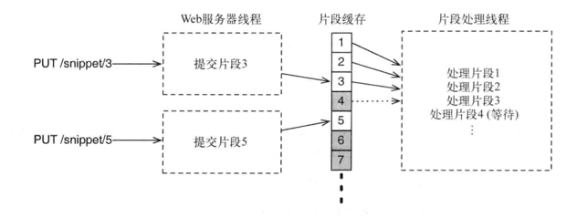

<!---
title:: 并发模式
date:: 2018-12-26 14:30
categories:: 编程语言, 系统与网络
tags:: csp, actor, function programming
-->

随着计算机硬件技术的发展，目前并发/并行编程越来越流行，我们使用的golang就是其中一个典型的例子，golang在并发模式上着重提供CSP的机制，同时也提供协程+锁模式。

目前我们的golang代码中使用最多的还是协程+锁的模式，少量代码使用了channel。我个人觉得，golang的协程+锁的模式比较灵活，对于我们的业务代码来说还是比较适合的。不过我们还是应该去了解更多的并发模式，在某些场景下协程+锁的模式还是有很明显的缺点，特别是写代码心智负担重和bug难以发现这两点。在合适的场景下使用合适的并发模式，肯定会事半功倍。

## 并发与并行
Rob Pike做过一个以[“Concurrency is not parallelism”](https://blog.golang.org/concurrency-is-not-parallelism)为题的演讲，感兴趣可以看看这个演讲或者看看这个演讲的幻灯片。

并发是同一时间应对多件事情的能力，并行是同一时间动手做多件事情的能力。

并发是问题域中的概念：程序需要被设计成能够处理多个同时(或者几乎同时)发生的事件。 并行是方法域中的概念：通过将问题这两个的多个部分并行执行，来加速解决问题。

我们后台服务端工作中大多数场景遇到的是并发，相对传统的串行方案，并发的方案具有可以发挥多核优势、及时响应、高效、容错、简单等优点。

目前并行和并发提供了各种层次上的支持，有些是计算机硬件上的，有些是系统层面上的支持，有些是语言层面的支持。比如计算机SIMD指令集、多核多任务，OS的线程，golang的go routine、channel等对并发和并行的提供了不同层面的支持。

## 线程与锁
大部分编程语言基本都可以提供线程与锁的模式，在正确使用某个编程语言的线程与锁，先应该了解给语言的内存模型，明确这个语言的happens-before语义，对于golang语言，刘浩之前已经介绍过了。其他语言也可以在该语言的文档中找到。

线程与锁模式是最接近计算机硬件的并发模式，线程是发挥了CPU多核多任务的优势，锁是利用CPU的LOCK前缀的指令来提供同步机制。原理和使用都算比较简单，正确使用效率很高，但是复杂场景下容易出错，很简单粗暴。

其他的并发模型有些就是基于线程和锁，比如Actor和CSP。

在多线程和锁的编程中，从坑里面爬出来并不难，难的是我们不知道自己是不是已经在坑里面！

#### 使用经验
+ 线程来实现并发，锁机制用于同步，选择合适的锁的类型
+ 只要有并发读写临界资源的场景就需要进行同步，临界资源包括共享变量、文件描述符等，通过锁来互斥访问临界资源
+ 尽量让锁在数据结构内部，尽量避免同时持有多把锁

#### 示例：哲学家就餐问题
在同时持有多把锁的时候，如果不采用一定的策略，容易发生死锁，解决死锁的方法之一就是将锁编号，按照一定顺序获取锁就不会发生死锁

换一种角度来看待这个问题，使用条件变量来进行同步！

## 函数式编程(以Clojure为例)
函数式编程在语法上很简单，几乎只要理解了λ算子就能掌握函数式编程的大部分语法。
```
(+ 1 2)
(max 5 8)
 
(defn add [a b]
  (+ a b))
 
(defn sum [numbers]
  (reduce + numbers))
```

函数式编程和命令式编程风格截然不同，命令式编程一般而言效率更高，但是要经常考虑“我应该把这个变量的赋值放在另一个之前还是之后呢？”。经典的函数式编程中数据是immutable的，函数没有副作用，同样的输入一定得到相同的输出，程序具有引用透明性，逻辑上的心智负担小于命令式编程。

函数式编程在数据并行处理上很有优势，目前数据分析领域的MapReduce以及Lambda架构都是借鉴了函数式编程中的思想。

#### 函数式并行：`fold+reduce`

单独的reduce只是一个串行的化简器，结合fold之后可以方便的并行。

fold使用二分算法：
1. 将集合分成两组，每组继续分为更小的两组，直到分组的规模小于某个限制值
1. 对每个分组进行逐个元素地化简
1. 对分组的结果进行两两合并，直到剩下一个最终的结果

fold创建了一个并行任务的处理树，化简和合并操作并行执行。

```
(ns sum.core
  (:require [clojure.core.reducers :as r]))
(defn recursive-sum [numbers]
  (if (empty? numbers)
    0
    (+ (first numbers) (recursive-sum (rest numbers)))))

(defn reduce-sum [numbers]
  (reduce (fn [acc x] (+ acc x)) 0 numbers))

(defn sum [numbers]
  (reduce + numbers))

(defn apply-sum [numbers]
  (apply + numbers))

(defn parallel-sum [numbers]
  (r/fold + numbers))
```

#### 函数式并发：`future+promise`
future函数接受一段代码，并在一个单独的线程中执行这段代码，返回一个future对象，使用deref或者简写对future对象进行解引用。
```
(def sum (future (+ 1 2 3 4 5)))
(deref sum)


(let [a (future (+ 1 2))
      b (future (+ 3 4))]
      (+ @a @b))
```

promise和future对象一样也是异步求值的，在求值前也会阻塞线程，也通过deref和@来解引用。不同的是创建一个promise对象后，使用promise对象的代码并不会立刻执行，等到使用deliver给promise对象赋值才会执行。

```
(def meaning-of-life (pormise))

(future (println "The meaning of life is:" @meaning-of-life))

(deliver meaning-of-life 18)
```

以一个函数式Web服务为例来说明函数式并发代码。



```
(def snippets (repeatedly promise))

(def translator "http://localhost:3001/translate")

(defn translate [text]
  (future
    (:body (client/post translator {:body text}))))

(def translations
  (delay
    (map translate (strings->sentences (map deref snippets)))))

(defn accept-snippet [n text]
  (deliver (nth snippets n) text))

(defn get-translation [n]

  @(nth @translations n))

(defroutes app-routes
  (PUT "/snippet/:n" [n :as {:keys [body]}]
    (accept-snippet (edn/read-string n) (slurp body))
    (response "OK"))
  (GET "/translation/:n" [n] 
    (response (get-translation (edn/read-string n)))))

(defn -main [& args]
  (run-jetty (wrap-charset (api app-routes)) {:port 3000}))
```

## Actor与CSP
Actor和CSP都是对线程和锁模型更高级的封装，只是侧重点不同。Actor内部保留状态，不共享，通过给Actor发送消息来修改内部状态，同时消息的处理是串行的。CSP侧重提供消息的传输的通道，提供channel和go代码块这两种机制，使用很灵活，方便解耦。

Actor在Erlang中取得巨大成功，特别是Actor模型可以方便分布式部署，同时其在代码容错上有很大优势。CSP在golang中也取得巨大成功，语言层面上对CSP模式提供了强大的支持，使用上特别灵活，之前的分享也介绍过golang的channel，我们平常使用golang也很多，这里只通过Rob Pike的素数筛代码来说明CSP。
```
package main
// Send the sequence 2, 3, 4, ... to channel 'ch'.
func Generate(ch chan<- int) {
	for i := 2; ; i++ {
		ch <- i // Send 'i' to channel 'ch'.
	}
}
// Copy the values from channel 'in' to channel 'out',
// removing those divisible by 'prime'.
func Filter(in <-chan int, out chan<- int, prime int) {
	for {
		i := <-in // Receive value from 'in'.
		if i%prime != 0 {
			out <- i // Send 'i' to 'out'.
		}
	}
}
// The prime sieve: Daisy-chain Filter processes.
func main() {
	ch := make(chan int) // Create a new channel.
	go Generate(ch)      // Launch Generate goroutine.
	for i := 0; i < 1000; i++ {
		prime := <-ch
		print(prime, "\n")
		ch1 := make(chan int)
		go Filter(ch, ch1, prime)
		ch = ch1
	}
}
```

这里以Erlang虚拟机上运行的语言Elixir语言来说明Actor，Elixir是一门不纯粹的，动态类型的函数式语言。

在Elixir中，actor对象类似golang中的goroutine，是一个轻量级的执行单元，每个actor都可以根据发送给其的消息进行相应的处理。发送的消息是一个元组tuple，使用{}代表元组，第一个表示消息类型，后面是消息参数。

```
defmodule Talker do
  def loop do
    receive do
      {:greet, name} -> IO.puts("Hello #{name}")
      {:praise, name} -> IO.puts("#{name}, you're amazing")
      {:celebrate, name, age} -> IO.puts("Here's to another #{age} years, #{name}")
      {:shutdown} -> exit(:normal)
    end
    loop
  end
end

Process.flag(:trap_exit, true)
pid = spawn_link(&Talker.loop/0)
send(pid, {:greet, "Huey"})
send(pid, {:praise, "Dewey"})
send(pid, {:celebrate, "Louie", 16})
send(pid, {:shutdown})
receive do
  {:EXIT, ^pid, reason} -> IO.puts("Talker has exited (#{reason})")
end
```

Actor最大的优势就是基于Erlang的OTP可以方便的分布式部署！

#### 示例：分布式词频统计


这里有三类Actor：一个Parser、多个Counter和一个Accumulator，每个Actor都可部署在单独的机器上。

解析器负责将一个WikiPedia dump文件解析为若干个页面，计数器负责统计单个页面的词频，累加器负责统计多个页面的词频总数。

现在很火的微服务感觉和Erlang中的Actor模式很类似。