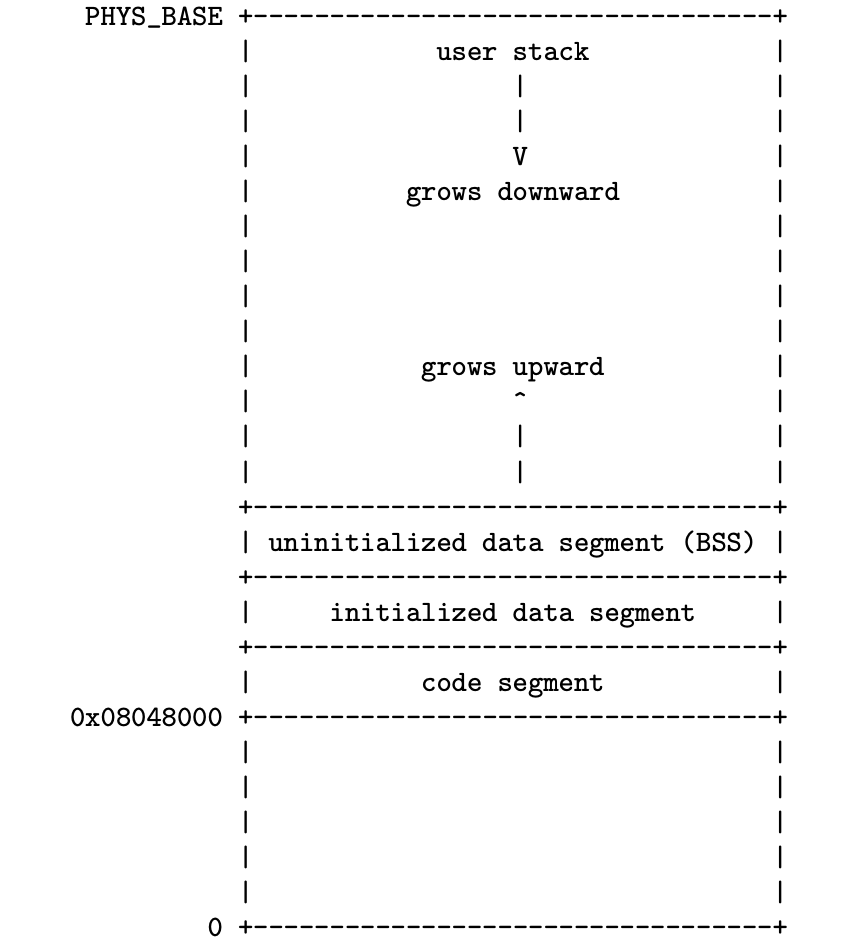

<!---
title:: Pintos虚拟内存机制初探
date:: 2015-02-05 21:08
categories:: 系统与网络
tags:: c, pintos, thread
-->

准备着手Pintos的Project 3时，发现难度远远比我想象中的大，而且操作系统虚拟内存这一块又确实是自己曾经很想弄明白但是又没有弄明白的地方。本来想先放一放Pintos的Project 3的，但是看到某个博主博文中的“宁可要一个或许不完美的结束，也不要一千个美好的开始”，于是又决定继续自己的Pintos之旅了。

在开始完成任务之前，我觉得有必要对操作系统虚拟内存有一个大概的认识，这里我是通过LKD和ULK中关于Linux内存管理的内容来熟悉这些内容，也会看看网上的一些博客。

这里说明的Pintos虚拟内存机制是最简单，也就是本身就有没有添加任何支持代码的虚拟内存机制，这个作为自己着手Project 3的一个开始。

Pintos在进入main()函数前，其实有一个basic page table，由loader来创建。



上图是Pintos的物理内存分布图，Pintos运行的物理内存大小只有4MB，前面1MB也就是0x00000-0xfffff之间是内核的运行时环境，包含了内核的运行时stack，代码段，数据段，bss等。后面的3MB的话，也是由Pintos内核来管理，这里由于物理内存很小，就不会存在Linux系统中说的高端内存的问题，如果物理内存很大的话，Pintos也会有高端内存的问题。

Pintos中内存的管理比较简单，内核中将0xffffff以上，也就是1MB以上的内存以page页的方式管理，分为两个池，kernel_pool和user_pool。
````
/* A memory pool. */
struct pool
  {
    struct lock lock;                   /* Mutual exclusion. */
    struct bitmap *used_map;            /* Bitmap of free pages. */
    uint8_t *base;                      /* Base of pool. */
  };

/* Initializes the page allocator.  At most USER_PAGE_LIMIT
   pages are put into the user pool. */
void
palloc_init (size_t user_page_limit)
{
  /* Free memory starts at 1 MB and runs to the end of RAM. */
  uint8_t *free_start = ptov (1024 * 1024);
  uint8_t *free_end = ptov (init_ram_pages * PGSIZE);
  size_t free_pages = (free_end - free_start) / PGSIZE;
  size_t user_pages = free_pages / 2;
  size_t kernel_pages;
  if (user_pages &gt; user_page_limit)
    user_pages = user_page_limit;
  kernel_pages = free_pages - user_pages;

  /* Give half of memory to kernel, half to user. */
  init_pool (&amp;kernel_pool, free_start, kernel_pages, "kernel pool");
  init_pool (&amp;user_pool, free_start + kernel_pages * PGSIZE,
             user_pages, "user pool");
}
````
这里是用bitmap来记录page的使用，kernel_pool有一个base字段，这个是为了在palloc_get_multiple()和palloc_get_page()返回的为kernel virtual address，也就是physical address+PHYS_BASE(0xc0000000 3GB)。
````
/* Populates the base page directory and page table with the
   kernel virtual mapping, and then sets up the CPU to use the
   new page directory.  Points init_page_dir to the page
   directory it creates. */
static void
paging_init (void)
{
  uint32_t *pd, *pt;
  size_t page;
  extern char _start, _end_kernel_text;

  pd = init_page_dir = palloc_get_page (PAL_ASSERT | PAL_ZERO);
  pt = NULL;
  for (page = 0; page &lt; init_ram_pages; page++)
    {
      uintptr_t paddr = page * PGSIZE;
      char *vaddr = ptov (paddr);
      size_t pde_idx = pd_no (vaddr);
      size_t pte_idx = pt_no (vaddr);
      bool in_kernel_text = &amp;_start &lt;= vaddr &amp;&amp; vaddr &lt; &amp;_end_kernel_text;

      if (pd[pde_idx] == 0)
        {
          pt = palloc_get_page (PAL_ASSERT | PAL_ZERO);
          pd[pde_idx] = pde_create (pt);
        }

      pt[pte_idx] = pte_create_kernel (vaddr, !in_kernel_text);
    }

  /* Store the physical address of the page directory into CR3
     aka PDBR (page directory base register).  This activates our
     new page tables immediately.  See [IA32-v2a] "MOV--Move
     to/from Control Registers" and [IA32-v3a] 3.7.5 "Base Address
     of the Page Directory". */
  asm volatile ("movl %0, %%cr3" : : "r" (vtop (init_page_dir)));
}
````
上面是内核给自己建立的页目录和页表项，对所有的4M物理内存都进行了映射。Pintos中分为两级，page dir和page table，由于物理内存只有4MB，也就是1024个page，内核的page dir中只有一项record是有效的，其他均为0，一个页表正好可以记录1024个page，只会有1个页表。

建立好这个页表后，在内核空间，CPU的MMU单元就会正确的通过kernel virtual address去找到正确的物理地址所在地方，并且对内核的代码段进行了写保护。

对于内核，对整个4MB空间都建立好了MMU需要的页目录和页表。在内核中通过palloc获得内存页，就可以直接使用返回的kernel virtual address，不会产生任何缺页异常。在用户空间的话，显然就没有这么简单。

在用户空间，每个User Program都会有自己的pagedir，并且这个pagedir开始初始化时，会将内核空间的pagedir的内容拷贝过来，这样每个User Program的pagedir都有内核空间的索引信息。如果我没有想错的话，应该是给内核来用，应该从用户空间进入内核空间，如果User Program的pagedir中有内核空间的信息，就不需要改变cr3中的值，而且内核也可以知道当前User Program私有的内存信息。让用户空间知道内核空间内存信息也没有任何不安全，因为内核空间的地址对于用户空间不可访问。
````
/* Creates a new page directory that has mappings for kernel
   virtual addresses, but none for user virtual addresses.
   Returns the new page directory, or a null pointer if memory
   allocation fails. */
uint32_t *
pagedir_create (void) 
{
  uint32_t *pd = palloc_get_page (0);
  if (pd != NULL)
    memcpy (pd, init_page_dir, PGSIZE);
  return pd;
}
````
User Program在还没有建立好用户空间的运行时环境时，pagedir只有内核空间的信息，在建立运行时环境时会动态添加页表项。建立运行时环境的load()例程中的load_segment()和setup_stack()都会导致添加页表项。
````
/* Adds a mapping from user virtual address UPAGE to kernel
   virtual address KPAGE to the page table.
   If WRITABLE is true, the user process may modify the page;
   otherwise, it is read-only.
   UPAGE must not already be mapped.
   KPAGE should probably be a page obtained from the user pool
   with palloc_get_page().
   Returns true on success, false if UPAGE is already mapped or
   if memory allocation fails. */
static bool
install_page (void *upage, void *kpage, bool writable)
{
  struct thread *t = thread_current ();

  /* Verify that there's not already a page at that virtual
     address, then map our page there. */
  return (pagedir_get_page (t-&gt;pagedir, upage) == NULL
          &amp;&amp; pagedir_set_page (t-&gt;pagedir, upage, kpage, writable));
}
````
上面的install_page()例程中，upage是ELF文件中编译器产生的logical address，kpage是在内核空间通过palloc分配来的页的kernel virtual address。install_page()函数就是在User Program的pagedir中添加logical address到physical address的页表项，这个过程中page是通过palloc申请得到的，所以有一个kernel virtual address到physical address的转换过程。

这里以一个例子来说明，这个例子是User Program将自己的代码段装载到内存中，同时在pagedir中添加内存映射信息，这个例子中的地址信息都是用gdb调试器获得。

User Program在运行前需要建立运行时环境，代码段、数据段、bss段、栈都需要申请页，同时建立相关pagedir的索引，供CPU的MMU正确寻址。在Pintos中先装载进来的是代码段，以4KB page为单位载入，多余的部分清零。
````
//这里用代码混合文字来说明，能说明问题就好
t=thread_current();
t->pagedir 0xc010e000
t->pagedir为用palloc申请到的一个page，此时page中只有一个项不为0，也就是内核空间的信息

load()例程中的load_segment()会给t->pagedir添加页表项记录，或许不止一项
static bool install_page(
void *upage, //0x08048000
void *kpage, //0xc0281000
bool writable //false
)
````
在install_page()例程中upage是ELF文件中GCC编译产生的logical address，0x08048000也可以看说代码段的起始地址，
而kpage是通过palloc在user_pool中申请到的page，kernel virtual address为0xc0281000，其对应physical地址为0x281000
writable为错，显然代码段不可写

install_page()调用了pagedir_get_page()和pagedir_set_page()
其中pagedir_get_page()是在t-&gt;pagedir中看是否有upage的映射信息，这里显然是没有的，如果有证明出错
pagedir_set_page()也会查找page dir中是否有upage对应的page table信息，
没有的话就会在kernel_pool申请一个page建立一个page table，修改page table中upage地址对应项为kpage的physical address
如果有的话，直接修改对应项即可

0x08048000(<span style="color: #00ff00;">0000100000</span><span style="color: #0000ff;">0001001000</span><span style="color: #800080;">000000000000</span>b)
在这个例子中，0x08048000对应的page table显然不存在，申请一个page为page table，同时更新t-&gt;pagedir中信息
记录这个page_table，page_table中upage对应的项也要修改为kpage对应的值。
pte为upage在page table中对应的entry项的地址：0xc010f120 pte中的内容为*pte:0x<span style="color: #00ff00;">00281</span><span style="color: #800080;">005</span>
这样CPU看到0x08048000就会自动去寻址0x00281000这个物理地址</pre>
User Program申请page建立好运行时环境，同时更新pagedir相关信息就可以运行了。